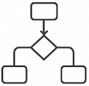
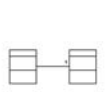

 # IdSw

||Datos (Qué)|Actividades (Cómo)|Ubicaciones (Dónde)|Personas (Quién)|Tiempo (Cuándo)|Motivación (Por qué)|
|-|-|-|-|-|-|-|
|**Objetivos / Alcance** *(Vista del Planificador)*|Lista de cosas importantes para la empresa  |Lista de funciones que realiza la empresa  |Lista de ubicaciones de la empresa  |Enfoques organizativos  |Calendario maestro de negocios  |Visión y misión de la empresa  |
|**Modelo empresarial** *(Vista del Propietario)*|Modelo de datos divergente, lenguaje  |Modelo de procesos de negocio  |Red logística  |Organigrama  |Diagrama de estados/transiciones  |Estrategias, tácticas, políticas y reglas  |
|**Modelo de conceptos fundamentales** *(Vista del Arquitecto)*|Modelo E/R convergente  |Diagrama de flujo de datos esencial  |Ubicación de roles  |Sistema viable, casos de uso  |Historia de vida de entidades  |Modelo de reglas de negocio  |
|**Modelo tecnológico** *(Vista del Diseñador)*|Diseño de base de datos  |Diseño del sistema, estructura del programa  |Distribución de hardware y software  |Interfaz de usuario, diseño de seguridad  |Procesamiento de eventos  |Diseño de reglas de negocio  |
|**Representación detallada** *(Vista del Constructor)*|Diseño del almacenamiento físico  |Diseño detallado del programa  |Arquitectura de red, protocolos  |Pantallas, codificación de seguridad  |Definición de tiempos  |Especificación de reglas, lógica de programa  |
|**Sistema en funcionamiento**|Bases de datos  |Inventario de programas, registros  |Instalaciones de comunicación  |Personas capacitadas  |Eventos empresariales  |Reglas aplicadas  |
